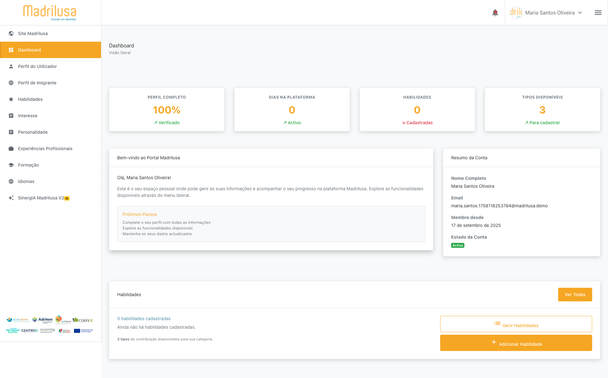

# 📋 ETAPA 3: Dashboard Inicial

## ✅ Status: SUCESSO
**Executado em:** 2025-09-17T14-18-09

## 🎯 Objetivo
Completar registro e mapear estrutura inicial do dashboard logado

## 🔄 Redirecionamento
- **URL Esperada:** http://localhost:8080/app/dashboard
- **URL Real:** http://localhost:8080/app/dashboard
- **Sucesso:** ✅ SIM
- **Modal Finalizado:** ❌ NÃO

## 👤 Usuário Logado
- **Nome Visível:** Maria Santos Oliveira
- **Posição:** Superior da tela (y: 28)
- **Detectado:** ✅ SIM

## 🗄️ Estrutura Dashboard

### 📝 Menus Principais (1)
- **menu** -> `#`

### 🔘 Botões Principais (3)
- **Ver Todas**
- **listGerir Habilidades**
- **addAdicionar Habilidade**

### 📑 Seções Identificadas (1)
- **[h2]** Dashboard

## 📸 Screenshots Capturados (3)
- 
- 
- 

## 📝 Observações
- Login realizado com usuário existente Maria Santos
- Etapa 3 concluída - Dashboard inicial mapeado

## ➡️ Próxima Etapa
**ETAPA 4:** Seção Habilidades - Aguardando aprovação para continuar
