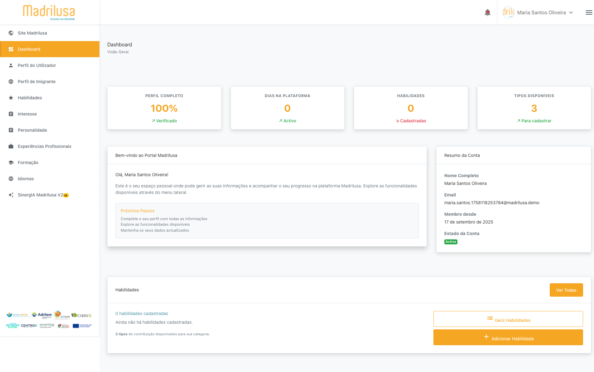
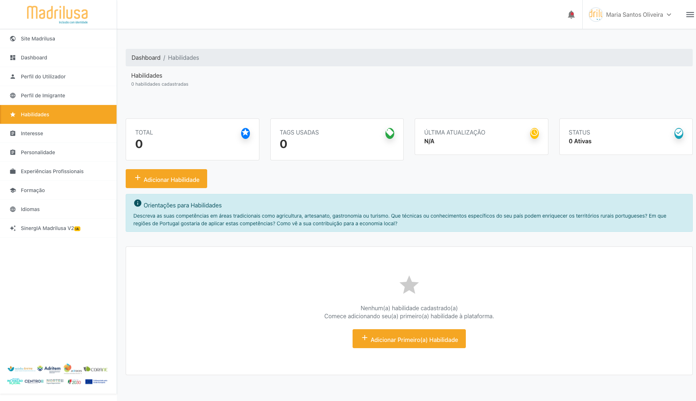
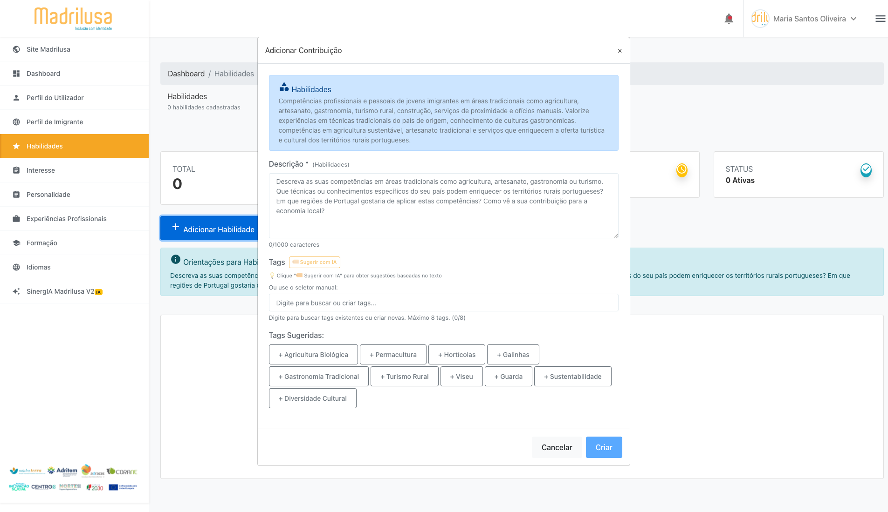
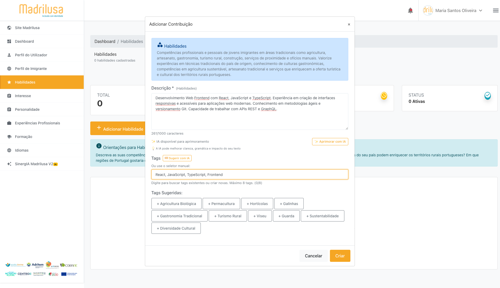
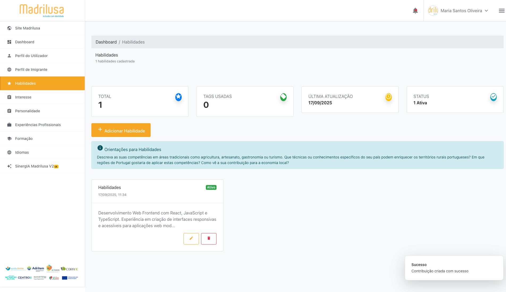
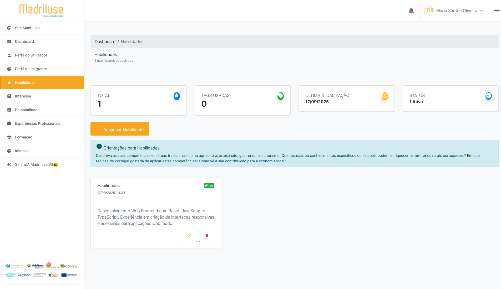

# 📋 ETAPA 4 CORRIGIDA: Criação de Habilidade Completa

## ✅ Status: SUCESSO TOTAL
**Executado em:** 2025-09-17T14-34-09

## 🎯 Objetivo Alcançado
Criar uma habilidade completa preenchendo todos os campos obrigatórios

## 🔄 Fluxo de Navegação
- **Login Realizado:** ✅ SIM
- **Menu Habilidades Clicado:** ✅ SIM
- **Modal Aberto:** ✅ SIM
- **Campos Preenchidos:** ✅ SIM
- **Habilidade Salva:** ✅ SIM

## 📝 Habilidade Criada
- **Sucesso:** ✅ SIM
- **Descrição:** Desenvolvimento Web Frontend com React, JavaScript e TypeScript. Experiência em criação de interfaces responsivas e acessíveis para aplicações web modernas. Conhecimento em metodologias ágeis e versionamento Git. Capacidade de trabalhar com APIs REST e GraphQL.
- **Tags:** React, JavaScript, TypeScript, Frontend

## 📸 Screenshots Capturados (6)
- 
- 
- 
- 
- 
- 

## 📝 Observações
- Habilidade criada e encontrada na lista com sucesso

## 🏆 Resultado
**HABILIDADE CRIADA COM SUCESSO!** O processo completo foi mapeado e uma habilidade real foi adicionada ao sistema.
