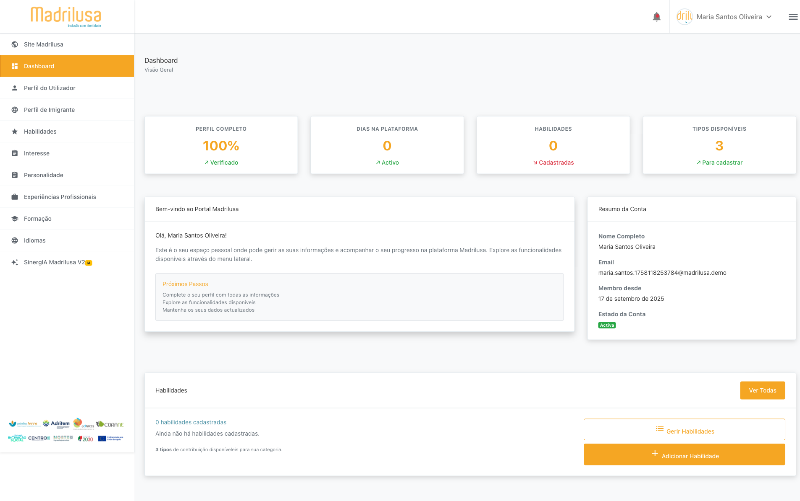
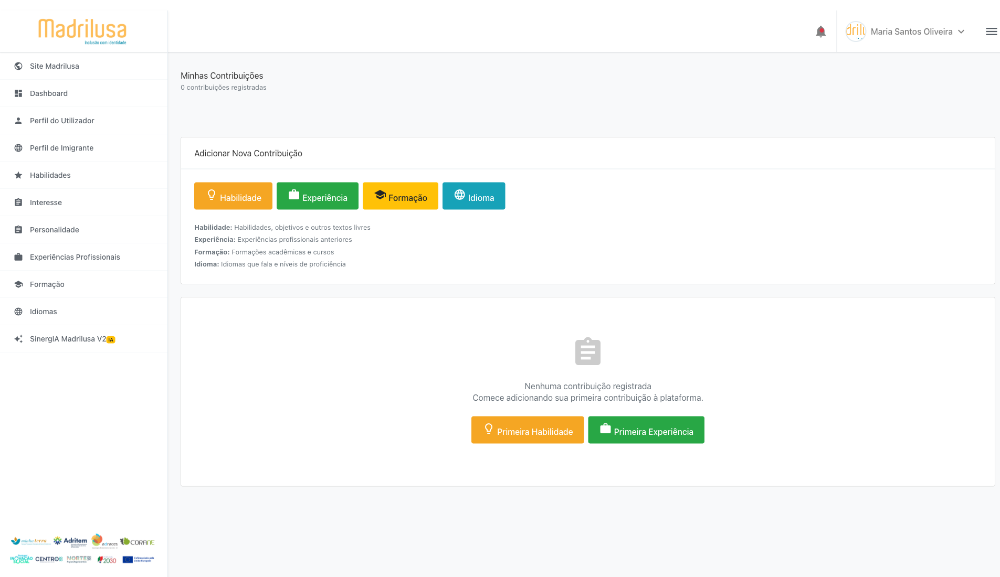

# 📋 ETAPA 4: Seção Habilidades

## ✅ Status: PARCIAL
**Executado em:** 2025-09-17T14-25-25

## 🎯 Objetivo
Mapear e testar funcionalidade de criação de habilidades

## 🗺️ Navegação
- **Dashboard Acessado:** ✅ SIM
- **Botão Habilidades Clicado:** ✅ SIM
- **Modal Habilidade Aberto:** ❌ NÃO

## 📝 Modal de Habilidade
- **Habilidade Criada:** ❌ NÃO
- **Lista Atualizada:** ❌ NÃO

### 📊 Dados Preenchidos
- Nenhum dado preenchido

### 🔍 Campos Mapeados (0)
- Nenhum campo mapeado

## 📸 Screenshots Capturados (2)
- 
- 

## 📝 Observações
- Modal de habilidade não abriu após clicar no botão
- Etapa 4 concluída - Seção habilidades mapeada

## ➡️ Próxima Etapa
**ETAPA 5:** Seção Interesses - Aguardando aprovação para continuar
