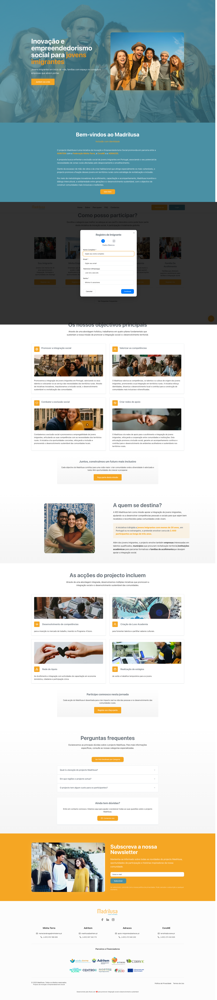
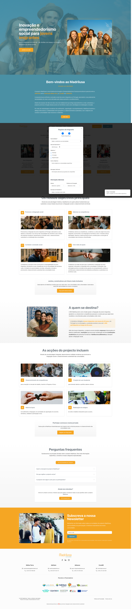
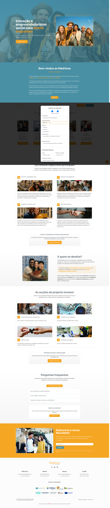

# 📋 ETAPAS 1+2: Sessão Única - Registro Completo

## 🎯 Metodologia
**Sessão única mantida** para preservar estado do modal e mapear fluxo real

**Executado em:** 2025-09-17T14-10-53

## 🔸 ETAPA 1: Dados Básicos

### 📊 Dados Preenchidos
- **nome:** Maria Santos Oliveira
- **email:** maria.santos.1758118253784@madrilusa.demo
- **telefone:** +351912345678
- **senha:** [preenchida]

### 🔍 Campos Mapeados (5)
- **Campo 0:** input[email] | Name: "" | ID: "" | Obrigatório: Sim
- **Campo 1:** input[input] | Name: "nomeCompleto" | ID: "nomeCompleto" | Obrigatório: Não
- **Campo 2:** input[email] | Name: "email" | ID: "email" | Obrigatório: Não
- **Campo 3:** input[input] | Name: "telemovel" | ID: "telemovel" | Obrigatório: Não
- **Campo 4:** input[password] | Name: "senha" | ID: "senha" | Obrigatório: Não

## 🔸 ETAPA 2: Dados Complementares

### 📊 Dados Preenchidos
- **data nascimento:** 1995-03-15

### 🔍 Campos Mapeados (15)
- **Campo 0:** input[email] | Name: "" | Valor: "" | Obrigatório: Sim
- **Campo 1:** input[input] | Name: "nacionalidade" | Valor: "" | Obrigatório: Não
- **Campo 2:** input[date] | Name: "dataNascimento" | Valor: "" | Obrigatório: Não
- **Campo 3:** input[checkbox] | Name: "" | Valor: "on" | Obrigatório: Não
- **Campo 4:** input[checkbox] | Name: "" | Valor: "on" | Obrigatório: Não
- **Campo 5:** input[checkbox] | Name: "" | Valor: "on" | Obrigatório: Não
- **Campo 6:** textarea[textarea] | Name: "objetivoOutros" | Valor: "" | Obrigatório: Não
- **Campo 7:** textarea[textarea] | Name: "mensagem" | Valor: "" | Obrigatório: Não
- **Campo 8:** select[select] | Name: "" | Valor: "F" | Obrigatório: Não
- **Campo 9:** select[select] | Name: "" | Valor: "Básica" | Obrigatório: Não
- **Campo 10:** input[input] | Name: "municipioResidencia" | Valor: "" | Obrigatório: Não
- **Campo 11:** input[checkbox] | Name: "" | Valor: "on" | Obrigatório: Não
- **Campo 12:** input[checkbox] | Name: "" | Valor: "on" | Obrigatório: Não
- **Campo 13:** input[checkbox] | Name: "" | Valor: "on" | Obrigatório: Não
- **Campo 14:** input[checkbox] | Name: "" | Valor: "on" | Obrigatório: Sim

## 📸 Screenshots Capturados
### Fluxo Completo:
- 

### ETAPA 1:
- 
- 

### ETAPA 2:
- 
- 

## 📝 Observações e Descobertas

### ETAPA 1:
- Etapa 1 executada em sessão contínua

### ETAPA 2:
- Etapa 2 executada em continuidade da sessão

### Fluxo Completo:
- Sessão única mantida entre etapas 1 e 2

## ➡️ Próxima Etapa
**ETAPA 3:** Dashboard Inicial - Completar registro e verificar redirecionamento
